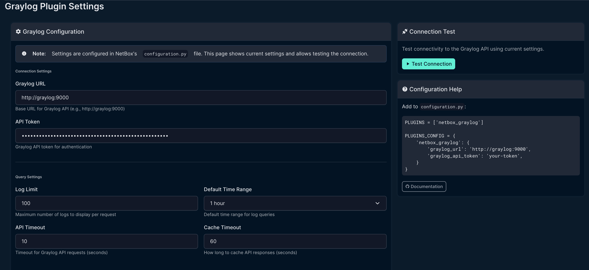
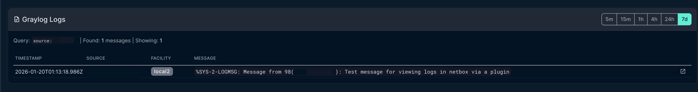

# NetBox Graylog Plugin


A NetBox plugin that displays recent Graylog logs in Device and VirtualMachine detail pages.


[](https://opensource.org/licenses/Apache-2.0)
[](https://github.com/sieteunoseis/netbox-graylog/actions/workflows/ci.yml)
[](https://pypi.org/project/netbox-graylog/)

## Features

- **Logs Tab**: Adds a "Logs" tab to Device and VirtualMachine detail pages
- **Time Range Selection**: Quick buttons for 5m, 15m, 1h, 4h, 24h, and 7d time ranges
- **Smart Search**: Searches by hostname first, falls back to primary IP if no results
- **Caching**: Caches API responses to reduce load on Graylog
- **Error Handling**: Graceful degradation when Graylog is unavailable

## Screenshots

### Settings Page
Configure Graylog connection settings directly in the NetBox UI.



### Logs Tab
View Graylog logs directly on Device and VirtualMachine pages.



## Requirements

- NetBox 4.0 or higher (tested on NetBox 4.x only)
- Graylog 4.0 or higher with API access
- Python 3.10+

> **Note:** This plugin is developed and tested exclusively on NetBox 4.x. It is not compatible with NetBox 3.x due to API and model changes.

## Installation

### From PyPI (when published)

```bash
pip install netbox-graylog
```

### From Source

```bash
git clone https://github.com/sieteunoseis/netbox-graylog.git
cd netbox-graylog
pip install -e .
```

### Docker Installation

Add to your NetBox Docker requirements file:

```bash
# requirements-extra.txt
netbox-graylog
```

Or for development:

```bash
# In docker-compose.override.yml, mount the plugin:
volumes:
  - /path/to/netbox-graylog:/opt/netbox/netbox/netbox_graylog
```

## Configuration

Add the plugin to your NetBox configuration:

```python
# configuration.py or plugins.py

PLUGINS = [
    'netbox_graylog',
]

PLUGINS_CONFIG = {
    'netbox_graylog': {
        # Required: Graylog API URL
        'graylog_url': 'http://graylog:9000',

        # Required: Graylog API token
        'graylog_api_token': 'your-api-token-here',

        # Optional settings with defaults:
        'log_limit': 50,           # Max logs to display
        'time_range': 3600,        # Default time range (1 hour)
        'timeout': 10,             # API timeout in seconds
        'cache_timeout': 60,       # Cache duration in seconds
        'search_field': 'source',  # Field to search (source or gl2_remote_ip)
        'use_fqdn': True,          # Use FQDN for hostname matching
        'fallback_to_ip': True,    # Try primary IP if hostname not found
    }
}
```

### Graylog API Token

1. Log into Graylog as an admin user
2. Go to **System** → **Users and Teams** → **Your User**
3. Click **Edit Tokens**
4. Create a new token with at least these permissions:
   - `searches:relative`
   - `streams:read` (if filtering by stream)

## Usage

Once installed and configured:

1. Navigate to any Device or VirtualMachine in NetBox
2. Click the **Logs** tab
3. View recent logs from Graylog
4. Use the time range buttons to adjust the search window

### Search Behavior

The plugin searches for logs using this strategy:

1. **Hostname search**: `source:{device.name}`
2. **IP fallback** (if enabled and no results): `gl2_remote_ip:{primary_ip}`
3. **Source IP fallback**: `source:{primary_ip}`

## Troubleshooting

### No logs appearing

- Verify the device name in NetBox matches the `source` field in Graylog
- Check if logs are being sent with FQDN or shortname
- Try disabling `use_fqdn` if your devices use shortnames
- Enable `fallback_to_ip` to search by IP address

### Connection errors

- Verify `graylog_url` is accessible from NetBox container
- Check that the API token has correct permissions
- For Docker, ensure both containers are on the same network

### Authentication errors

- Verify the API token is valid and not expired
- Check Graylog user has required permissions

## Development

### Setup

```bash
git clone https://github.com/sieteunoseis/netbox-graylog.git
cd netbox-graylog
pip install -e ".[dev]"
```

### Code Style

```bash
black netbox_graylog/
flake8 netbox_graylog/
```

## Documentation

Full documentation is available in the [GitHub Wiki](https://github.com/sieteunoseis/netbox-graylog/wiki).

## Changelog

See [CHANGELOG.md](CHANGELOG.md) for release history and breaking changes.

## License

Apache License 2.0 - See [LICENSE](LICENSE) for details.

## Contributing

Contributions are welcome! Please:

1. Fork the repository
2. Create a feature branch
3. Submit a pull request

## Credits

Inspired by the [LibreNMS Graylog integration](https://docs.librenms.org/Extensions/Graylog/).
